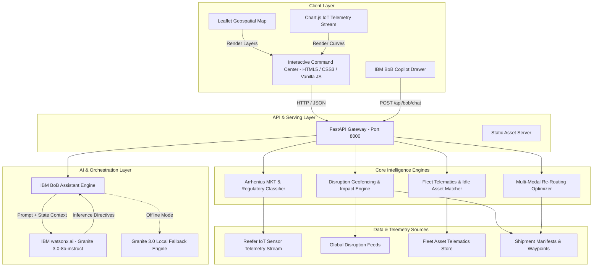
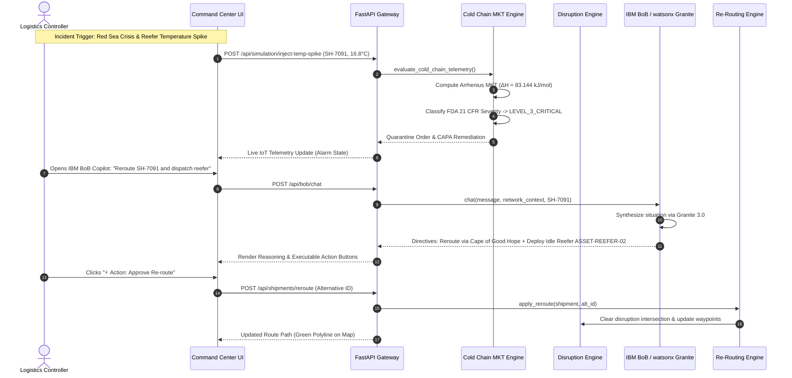

# System Architecture: NexusSupply AI

## 1. System Architecture

NexusSupply AI is designed as a modular, event-driven intelligence system integrating geospatial geofencing, pharmaceutical thermal kinetics, multi-modal re-routing optimization, and conversational LLM reasoning via **IBM BoB** and **watsonx.ai Granite 3.0**.

---

## 2. End-to-End Sequence Flow

---

## 3. System Components

| Component | Technology | Responsibility |
|---|---|---|
| **Frontend Command Center** | HTML5, CSS3, Vanilla JavaScript, Chart.js, Leaflet.js | High-contrast dark mode dashboard, trade lane visualization, real-time telemetry streaming, interactive BoB chat drawer. |
| **API Gateway & App Server** | Python 3.11+, FastAPI, Uvicorn, Pydantic v2 | High-throughput async REST endpoints, request validation, state management, and static file serving. |
| **Cold Chain Sentinel** | Python (Math, Arrhenius Kinetics, Numerical Integration) | Scientific Mean Kinetic Temperature calculation, cumulative degree-hours, WHO PQS & FDA 21 CFR regulatory excursion classification. |
| **Disruption Geofencing** | Python (Haversine Spherical Trigonometry) | Spatial waypoint containment calculation against active geopolitical and weather disruption zones. |
| **Carrier & Rerouting Engine** | Python | Multi-modal trade-off matrix generation (Cost delta, days saved, carbon emissions footprint $\text{tCO}_2$, carrier reliability). |
| **Fleet Utilisation Optimizer** | Python | Idle asset telematics tracking (>24h dwell detection), proximity-based asset matching, and emergency redeployment. |
| **IBM BoB Copilot** | IBM BoB, watsonx.ai Granite 3.0 (`ibm/granite-3-8b-instruct`), httpx | Multi-echelon supply chain reasoning, natural language triage, and actionable tool-calling directives. |

---

## 4. End-to-End Data Flow

1. **Telemetry & Event Ingestion**:
   IoT sensors continuously stream temperature (°C), relative humidity (%), door latch states, and ambient temperatures into the system at regular sampling intervals.
2. **Kinetics Processing (Arrhenius MKT)**:
   The Cold Chain Sentinel processes incoming temperatures using the exponential Arrhenius reaction model:
   $$T_k = \frac{\frac{\Delta H}{R}}{-\ln\left( \frac{1}{n} \sum_{i=1}^n e^{-\frac{\Delta H}{R T_i}} \right)}$$
   where $T_i$ is in Kelvin, $\Delta H = 83.144 \text{ kJ/mol}$, and $R = 8.314 \text{ J/(mol}\cdot\text{K)}$.
3. **Disruption Geo-Intersection**:
   Shipment coordinate trajectories are tested against disruption polygons/radii using spherical Haversine distance. When an intersection occurs, delay predictions are applied and value-at-risk counters increment.
4. **Autonomous AI Reasoning**:
   When queried or triggered, the state graph is serialized into a structured prompt context and passed to **IBM BoB** powered by **watsonx.ai Granite 3.0**. BoB returns structured recommendations and actionable JSON payloads.
5. **Human-in-the-Loop Execution**:
   The dispatcher reviews recommendations on the Command Center UI and executes carrier re-routing or reefer redeployment with a single click, instantly broadcasting updated waypoints and carrier directives across the network.

---

## 5. Security & Compliance Considerations

- **Zero Hardcoded Secrets**: All API keys, project IDs, and endpoints are loaded exclusively from `.env` via `python-dotenv`. `.env` is permanently ignored in `.gitignore`.
- **FDA 21 CFR Part 11 / Part 211 Compliance**: Telemetry history maintains immutable timestamps, tamper-evident door breach flags, and pre-delivery quarantine holds.
- **Cryptographic Audit Packages**: Generates standardized, downloadable regulatory compliance certificates with digital audit signatures for border inspections.
- **Least-Privilege API Design**: All mutating endpoints (`/api/shipments/reroute`, `/api/fleet/redeploy`) enforce explicit schema validation via Pydantic.

---

## 6. Scalability & Production Readiness

- **Asynchronous Architecture**: FastAPI and Uvicorn provide non-blocking I/O capable of handling thousands of concurrent IoT telemetry pings per second.
- **Microservice Decoupling**: The cold-chain monitor, disruption geofencing engine, and fleet optimizer are completely decoupled and can be deployed independently as serverless IBM Cloud Functions or containerized on Red Hat OpenShift.
- **Database Scalability**: The data access layer is cleanly abstracted with Pydantic models, ready to transition seamlessly from in-memory cache to PostgreSQL / IBM Cloud Databases for PostgreSQL and Redis pub/sub.
